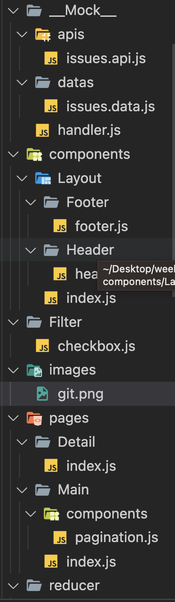
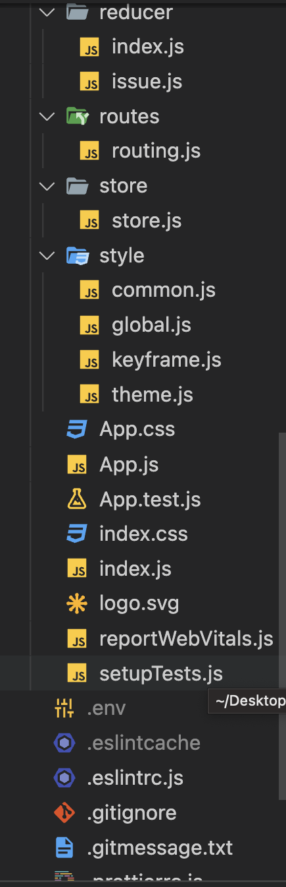

# Got Project

## 팀원

**<a href='https://github.com/uniend' alt='이유경'>이유경</a>**

**<a href='https://github.com/jeje0311' alt='정지현'>정지현</a>**

**<a href='https://github.com/dbs271' alt='윤국현'>윤국현</a>**

## 프로젝트 설명

angular api를 활용해 issue 데이터 목록과 상세 페이지를 보여주는 프로젝트
이에 페이지네이션, 필터 기능을 곁들인,,

## 배포주소

https://jolly-tarsier-2ad93d.netlify.app/

## 프로젝트 폴더 구조

## 사용 기술 스택

- <a href='https://redux-toolkit.js.org/' alt='redux-toolkit'>redux-toolkit</a>
- <a href='https://styled-components.com/' alt='styled-components'>styled-components</a>
- <a href='https://www.npmjs.com/package/styled-reset' alt='styled-reset'>styled-reset</a>
- <a href='https://axios-http.com/kr/docs/intro' alt='axios'>axios</a>
- <a href='https://mswjs.io/' alt='msw'>msw</a>
- <a href='https://reactrouter.com/en/main' alt='react-router-dom'>react-router-dom</a>
- <a href='https://www.npmjs.com/package/react-collapse' alt='react-collapse'>react-collapse</a>
- <a href='https://react-redux.js.org/' alt='react-redux'>react-redux</a>
- <a href='https://www.npmjs.com/package/redux-logger' alt='redux-logger'>redux-logger</a>

## 요구사항 구현 내역

- 목록 페이지 - 완성
- 페이지네이션 - 완성
- 필터 기능 - 미완성
- 상세페이지 - 완성

### 상세 요구 사항

**완성한 요구사항**

- 목록페이지
- 이슈 데이터를 가져와야하는 레퍼지토리는 https://github.com/angular/angular-cli를 활용 할 것
- 이슈 목록은 10개 단위의 페이지네이션으로 구현할 것
- 만약 총 이슈의 갯수가 200개가 안된다고 하더라도 빈 페이지가 보이도록 구현
- 현재 페이지의 숫자는 포커스 되어있어야 할것 < 1, 2, 3, [4], 5, 6 , 7, 8, 9 , 10 >
- 10페이지 단위로 마지막 페이지에서 다음 페이지를 누르면 다음 10 페이지가 뜨도록 구현할 것
- 버튼은 [맨처음] [이전] 1, [2], 3, 4, 5 [다음] [맨끝]으로 구현할 것
- 목록은 RTK를 활용하여 전역 상태 관리 할 것
- 페이지네이션 구현 시 뒤로가기 기능을 지원해야한다.
- 모바일 및 태블릿 화면으로 봐도 UX에 불편함이 없어야 함
- 상세페이지 모바일 및 태블릿 화면으로 봐도 UX에 불편함이 없어야 함
- 상세페이지: 이슈의 id 값을 활용하여 api를 요청하고 해당 issue의 상세페이지를 구현할 것 - 모르겠어요,, id값 받아와서 하지 않고 url에다 number 넣어서 해당 주소로 이동하게 했어요,,,
